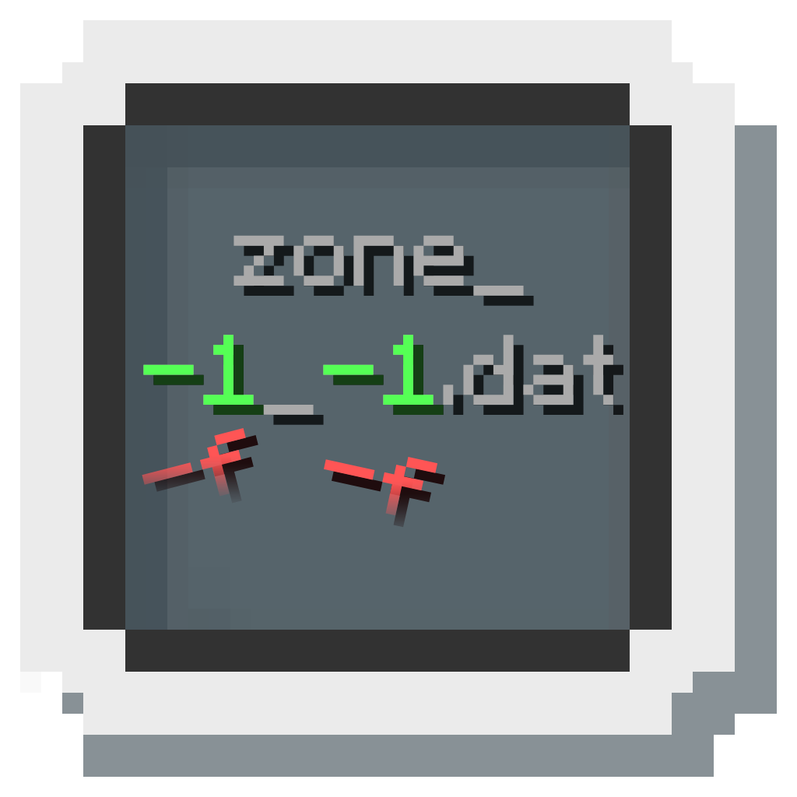

	

<h1 align="center">LoadZone</h1>

A small Ornithe mod to fix Notch's broken Zone filename code in Infdev 20100624

### *Why?*
When Notch was developing the Zone file format, he had set the filenames to use the chunk coordinates passed into the method, instead of using the Zone's coordinates.

Because of how the method is called, anytime the game attempts to get a chunk that is in a new zone, a new Zone file is created.

This breaks many things:
- Because the first chunk that is called for is not always at chunk offset `0,0`, the filenames are almost random, as they are based on whatever the first chunk the client decided to load was at that time. 
- World writers are broken, as the client will NOT load chunks whose chunk position does not match the Zone file's name.
  - In [libLodestone](https://github.com/Team-Lodestone/libLodestone), we have decided to follow the format of LoadZone by writing the Zone coordinates, instead of some random chunk coordinates.
- There's a chance that on load, the first chunk to load in a given Zone is NOT the same as the one that initially created it.
  - This means Zones may 'reset' outright after one or more rejoins.
- Loading a Zone from a different angle may cause it to generate a new zone. (untested!!!)
  - Again, it is all dependent on what chunk the client attempted to pull inside any given zone.
### *What's different?*
Zone files (`zone_{x}_{z}.dat`,`entity_{x}_{z}.dat`) now use their Zone coordinates in the filename, instead of the coords of the first chunk that would create the Zone file.

> [!IMPORTANT]
> Worlds created with LoadZone are NOT compatible with vanilla clients.
>
> Likewise, worlds created in vanilla are NOT compatible with clients running LoadZone.
>
> To help prevent accidental loading, LoadZone checks for a marker file (`.loadzone`) before loading a world to determine whether it is safe to load.
> In the event the file does not exist (such as the world being vanilla), the player is notified that they are about to load a vanilla world, and is given the option to cancel.

### *But, what **are** zones?*
It is essentially McRegion before McRegion, with the format being written by Notch during the infdev era of Minecraft.

More info can be found at the [Minecraft Wiki page for the Zone File Format](https://minecraft.wiki/w/Zone_file_format), which was previously mostly undocumented before our discoveries during the development of libLodestone.
